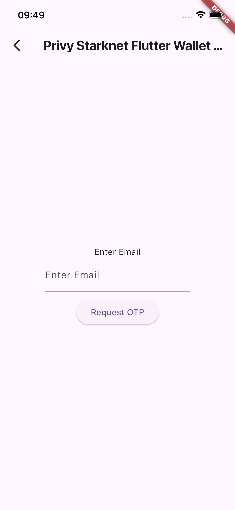
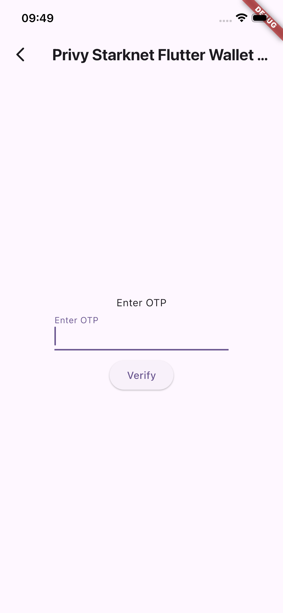
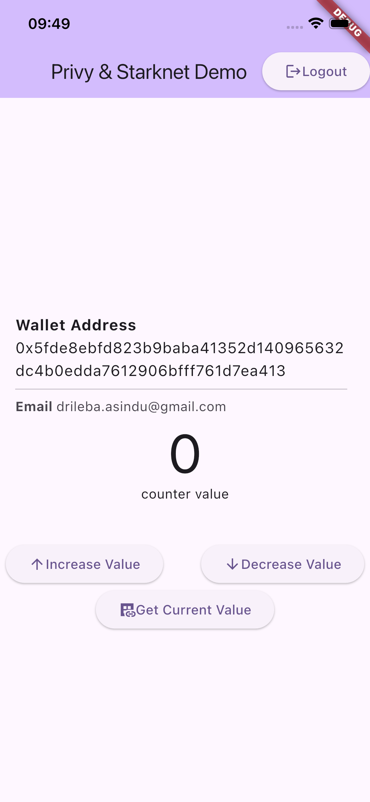

# Privy Starknet Wallet Demo

A Starknet Wallet using Privy for demo purposes.

## Features

- [x] Wallet creation on Privy

- [x] Argent Account deployment

- [x] Read values from smart contracts via [starknet.dart](https://pub.dev/packages/starknet)

- [x] Write values to smart contracts via privy

- [x] Paymaster support

- [x] Flutter wallet that runs on iOS & Android

## Overview

The project is divided into three parts.

- The backend (server)
  
- Flutter Wallet
  
- Counter contract

### Backend for (API)

[Read the Docs](https://github.com/as1ndu/privy-starknet-wallet-demo/tree/main/cf-back-end)

### Flutter Wallet

[Read the Docs](https://github.com/as1ndu/privy-starknet-wallet-demo/tree/main/privy_starknet_wallet)

### Cairo contracts

[Read the Docs](https://github.com/as1ndu/privy-starknet-wallet-demo/tree/main/contract)

### Demo video & pictures

[Youtube Video](https://www.youtube.com/watch?v=_xThl6UCp7U)

  
  
  

